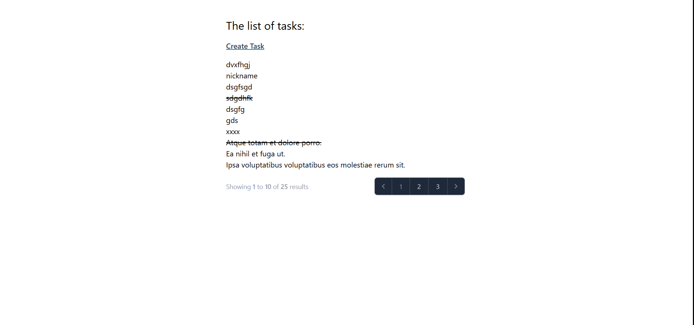

# 🐝 Taskhive

Taskhive is a sleek and powerful web-based to-do list app built with modern technologies. Easily manage your daily tasks: create, update, delete, or mark them as completed — all in a clean and responsive interface.

---

## ✨ Features

- 📝 Add tasks to stay organized  
- ✏️ Edit tasks anytime  
- ❌ Delete tasks you no longer need  
- ✅ Mark tasks as completed  
- 🌗 Responsive UI with Tailwind CSS  
- 📦 Easy setup with Docker  

---

## 🔧 Tech Stack

| Technology   | Description                   |
|--------------|-------------------------------|
| Laravel      | Backend framework (PHP)       |
| Tailwind CSS | Utility-first CSS framework   |
| MySQL        | Relational database           |
| Docker       | Containerization              |

---

## 📦 Getting Started

### 1. Clone the repository

```bash
git clone https://github.com/DrXendria/taskhive.git
cd taskhive
```

### 2. Setup environment file

```bash
cp .env.example .env
```

> Make sure to adjust the `.env` variables if needed (like DB credentials).

### 3. Run the project

You can use **Docker Desktop** to start the containers easily.  
Once Docker is running, the services should start automatically if configured correctly.

If not:
- Open Docker Desktop
- Go to **Containers** tab
- Find the container named `taskhive-app` or similar
- Start it manually

### 4. Run Laravel setup commands

Open a terminal and run the following in the container:

```bash
composer install
php artisan key:generate
php artisan migrate
```

Once everything is up, visit: [http://localhost:8000](http://localhost:8000)

---

## 📸 Screenshot

<p align="center">
  
</p>

---

## 🤝 Contributing

Contributions are welcome! Feel free to open issues or submit pull requests to improve the project.

---

## 📄 License

This project is licensed under the [MIT License](LICENSE).

---

## 💬 Contact

Have feedback or questions? Reach out via GitHub issues or at emir@emircica.com.
